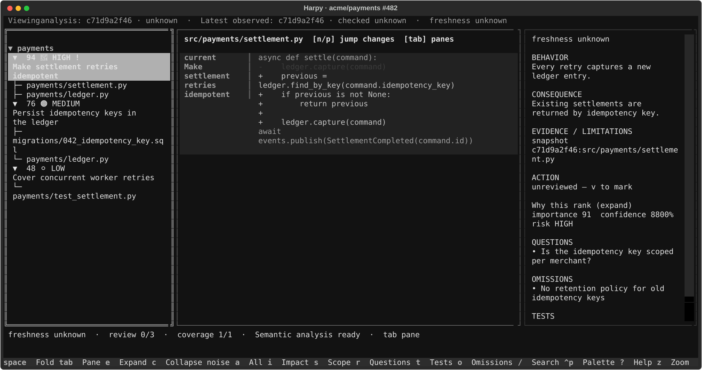
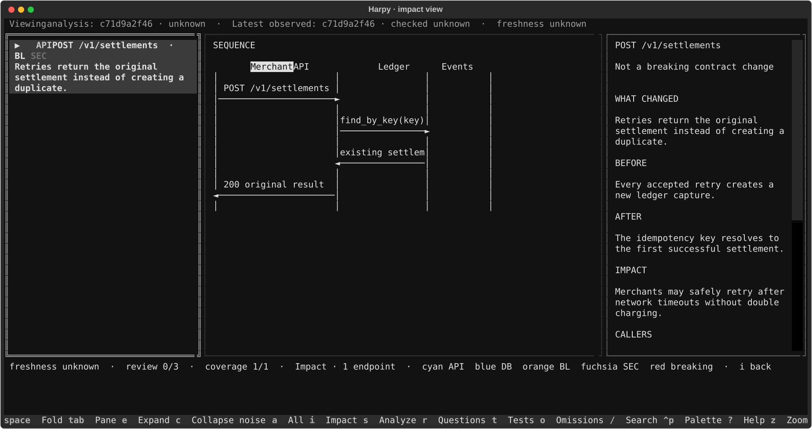
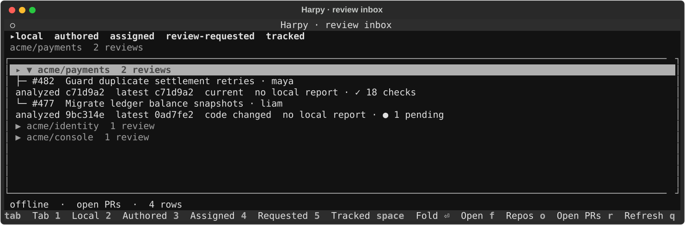

<div align="center">
  
  <h1>Harpy</h1>
  <p><strong>Review the decisions, not the diff volume.</strong></p>
  <p>
    A terminal PR reviewer that turns sprawling, AI-generated diffs into ranked,
    evidence-backed logical changes.
  </p>
  <p>
    <a href="https://github.com/NDobrev/harpy/actions/workflows/check.yml"></a>
    
    <a href="LICENSE"></a>
    
  </p>
  <p>
    <a href="#install">Install</a> ·
    <a href="#quick-start">Quick start</a> ·
    <a href="#the-review-workspace">Tour</a> ·
    <a href="#command-reference">Commands</a>
  </p>
</div>

> **Compress code volume, not decision information.**

A 4,000-line pull request may contain only five decisions worth reviewing.
Harpy finds those **logical changes**, ranks them by review priority, explains
their before/after behavior and blast radius, and keeps the exact supporting
diff one keystroke away.



<div align="center">
  <sub><strong>Normal review:</strong> ranked decisions on the left, supporting diff in the center, reasoning and questions on the right.</sub>
</div>

## Why Harpy?

| A normal diff gives you… | Harpy adds… |
|---|---|
| Files in path order | Decisions ranked by review priority |
| Every changed line at once | A focused diff for the selected logical change |
| Implementation details | Before/after behavior and business effect |
| A flat list of touched files | Approximate callers, routes, tests, and blast radius |
| No record of review progress | Durable reviewed, blocker, question, and note state |
| An all-or-nothing AI dependency | Deterministic static analysis when AI is unavailable |

Harpy is particularly useful when code is generated faster than humans can
comfortably read it—but its output supports reviewer judgment; it does not
replace it.

## Install

### Prerequisites

- Python **3.12+**
- [`git`](https://git-scm.com/)
- [GitHub CLI (`gh`)](https://cli.github.com/), authenticated with `gh auth login`
- `cursor-agent` for semantic analysis *(optional)*
- `rg` for faster source lookup *(optional; Harpy has a Python fallback)*

### Install with `uv` (recommended)

```bash
uv tool install git+https://github.com/NDobrev/harpy.git
harpy doctor
```

Or use `pipx`:

```bash
pipx install git+https://github.com/NDobrev/harpy.git
harpy doctor
```

<details>
<summary><strong>Install for development</strong></summary>

```bash
git clone https://github.com/NDobrev/harpy.git
cd harpy
make setup
uv run harpy doctor
```

Run the full acceptance suite with `make check`.
</details>

## Quick start

From any local clone of the repository you want to review:

```bash
# Open your review inbox and local history
harpy

# Review a PR by number
harpy 482

# Or review it from anywhere
harpy --repo acme/payments 482

# PR URLs work too
harpy https://github.com/acme/payments/pull/482
```

Harpy first opens a usable static review. Press <kbd>s</kbd> to choose which
semantic checks to run; the optional analyzer works read-only against the PR
snapshot.

Need machine-readable or static output instead?

```bash
harpy analyze 482 --json
harpy analyze 482 --static
```

## The review workspace

Harpy is organized around the reviewer's questions:

1. **What changed?** Related hunks become one logical change, even across files.
2. **What deserves attention first?** Importance and unexpectedness determine review priority.
3. **What behavior moved?** Before/after summaries explain the decision, not just the syntax.
4. **What could this affect?** Impact views surface contracts, schemas, callers, workers, and tests.
5. **What is still uncertain?** Questions, omissions, confidence, and source evidence stay visible.

### Follow a change from decision to evidence

The normal view keeps three levels of detail visible at once:

- **Navigator** — logical changes ranked by risk and review priority, with their
  files nested underneath.
- **Diff canvas** — only the hunks supporting the selected change, with the
  current review context highlighted.
- **Inspector** — before/after behavior, business effect, confidence, questions,
  possible omissions, tests, and reviewer state.

Press <kbd>e</kbd> when you need the full diff, <kbd>z</kbd> to focus one pane,
or <kbd>r</kbd>, <kbd>t</kbd>, and <kbd>o</kbd> to switch the inspector between
questions, tests, and omissions.

### See the impact, not just the edit

Press <kbd>i</kbd> to pivot from changed lines to changed contracts. Harpy puts
API and database impacts in one navigable view: affected files on the left, a
sequence, flow, schema, or blast-radius rendering in the center, and the
before/after contract with callers and risk on the right.



<div align="center">
  <sub><strong>Impact view:</strong> API / DB surface → rendered behavior → contract details and callers.</sub>
</div>

Diagrams are deliberately optional. Harpy renders one only when a sequence,
schema, flow, or blast tree communicates the change better than prose.

### One inbox for active and remembered reviews

Run `harpy` or `harpy browse` to see local reports alongside PRs you authored,
were assigned, or were asked to review. Reports are grouped by repository and
show whether the analyzed revision is still current.



The browser caches GitHub results for resilient offline use. Run
`harpy browse --offline` when you explicitly want local data only.

### Keyboard-first, without hiding the controls

| Key | Review action | Key | Review action |
|---|---|---|---|
| <kbd>j</kbd> / <kbd>k</kbd> | Move or scroll | <kbd>Tab</kbd> | Next pane |
| <kbd>Space</kbd> | Fold or unfold | <kbd>z</kbd> | Maximize focused pane |
| <kbd>i</kbd> | API / DB impact | <kbd>s</kbd> | Choose analysis scope |
| <kbd>r</kbd> | Review questions | <kbd>t</kbd> | Test analysis |
| <kbd>o</kbd> | Possible omissions | <kbd>/</kbd> | Search everything |
| <kbd>v</kbd> | Mark reviewed | <kbd>b</kbd> | Toggle blocker |
| <kbd>m</kbd> | Add a note | <kbd>Ctrl</kbd>+<kbd>P</kbd> | Command palette |
| <kbd>?</kbd> | In-app help | <kbd>q</kbd> | Quit |

The layout adapts from a three-pane desktop view to narrow terminals. Review
state, notes, selected change, and freshness survive between sessions.

## Choose only the analysis you need

Press <kbd>s</kbd> inside a review to select checks for logical changes, API
impact, database impact, security, review questions, tests, omissions, and
diagrams.

- Space toggles a check; Enter starts the selected analysis.
- Presets save reusable check and model combinations.
- A shared model can be overridden for individual checks.
- **Run details** shows call grouping and dependencies before anything runs.
- Test analysis reads code and tests; it does **not** execute the test suite or
  claim runtime coverage.

Semantic analysis is optional. If the agent is missing, times out, or returns
invalid output, Harpy keeps the deterministic static ranking and clearly marks
the degraded result.

## How it works

```text
PR number / URL
       │
       ▼
immutable revision snapshot
       │
       ├── deterministic signals ── syntax facts, paths, references, diff shape
       │
       └── optional read-only analyzer ── behavior, grouping, questions, impact
                         │
                         ▼
              ranked logical changes
                         │
                         ▼
      review workspace + durable local report
```

The final priority is not an opaque model score. Static evidence contributes
independently, and high importance is never hidden just because confidence is
low. See the [implementation design](docs/design/impl.md) for scoring and
degradation rules.

## Command reference

| Command | Purpose |
|---|---|
| `harpy` | Open the browser |
| `harpy <PR>` | Analyze and review a PR |
| `harpy --repo owner/name <PR>` | Review a PR outside its local clone |
| `harpy review <PR> --no-ai` | Open a static-only review |
| `harpy browse --offline` | Browse cached inbox data and local reports |
| `harpy history <reference>` | List local reports for a review |
| `harpy analyze <PR> --json` | Emit the analysis as JSON |
| `harpy analyze <PR> --static` | Print deterministic file ranking |
| `harpy doctor [--json]` | Check tools, authentication, repository, and model |
| `harpy config init` | Write `.harpy.toml` in the current repository |
| `harpy cache stats` | Show cached artifact count and size |
| `harpy cache clean` | Remove cached analyses, artifacts, and worktrees |
| `harpy schema` | Print the semantic output JSON Schema |

Run `harpy <command> --help` for every option.

## Configuration

Create a repository-local configuration:

```bash
harpy config init
```

`.harpy.toml` controls the semantic model, timeout, scoring weights, generated
paths, and high- or low-impact path patterns. CLI `--model` overrides the
configured model for a run.

## Troubleshooting

Start with:

```bash
harpy doctor
```

| Symptom | What to check |
|---|---|
| `gh_auth ✗` | Run `gh auth login`, then retry |
| `cursor_agent ✗` | Static review still works; install Cursor Agent for semantic checks |
| Semantic analysis unavailable | Static ranking remains usable; retry selected scopes with <kbd>s</kbd> |
| GitHub rate limit | Harpy keeps cached inbox rows; use `--offline` until the limit resets |
| Review is marked stale | Reopen or refresh it to analyze the latest revision |

## Project

- [Review workspace design](docs/design/review-workspace.md)
- [Analysis implementation](docs/design/impl.md)
- [Domain glossary](docs/CONTEXT.md)
- [Contributing and agent instructions](AGENTS.md)

Harpy is licensed under the [MIT License](LICENSE).
