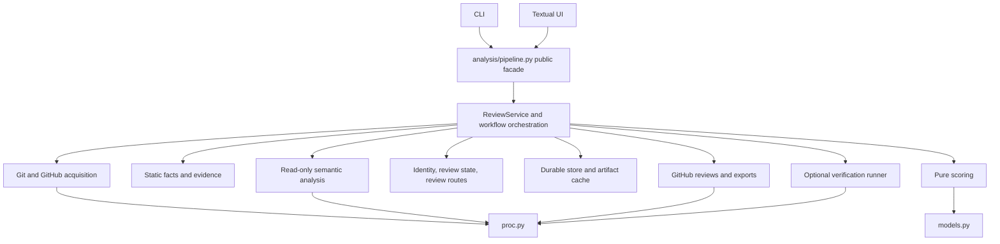

# Harpy: Detailed Implementation Plan for a Daily Review Workspace

## 1. Product Contract and Delivery Principles

### Objective

Evolve Harpy from an analysis viewer into a persistent review workspace for:

- Reviewing code produced by your own agents.
- Reviewing other people's pull requests.
- Understanding behavior, verifying intent, collecting evidence, and communicating decisions.
- Returning after a revision without repeating unaffected review work.

This plan covers all 72 previously proposed improvements. The final traceability table maps every idea to an implementation task.

### Decisions fixed by this plan

| Area | Decision |
|---|---|
| Primary interface | Redesigned Textual terminal application. No browser application or backend server. |
| Supported sources | GitHub PRs and local Git repositories. |
| GitHub access | Existing `gh` authentication and CLI adapter. No separate token configuration. |
| Review memory | Local, durable storage. No cloud synchronization. |
| Existing analysis | Display immediately when available, even if stale. Clearly identify the analyzed revision. |
| New revisions | Detect through metadata refresh; never automatically purchase semantic analysis. |
| New reviews | Open static information and require an explicit analysis action. |
| Incremental analysis | Default update strategy; include affected dependencies, not merely newly edited lines. |
| Headless operation | Explicit CLI command analyzes and persists results without opening the TUI. |
| PR browser | Include local analysis history, authored PRs, assigned PRs, and review requests. |
| Language coverage | Python, TypeScript/TSX, Go, Rust, and SQL receive corresponding supported-language features together. |
| Test execution | Optional, separately authorized Docker runner. The semantic analyzer remains read-only. |
| Models | Preserve the configured default and per-scope model overrides. Do not change the pinned model. |
| UI compatibility | Existing shortcuts remain aliases where practical; pane organization may change substantially. |
| Repository workflow | Continue local task files and local Git history. Do not add a remote to Harpy. |

JavaScript files without TypeScript syntax, Java, and other unsupported languages retain text-diff and semantic review support. They must not be presented as having full syntax or assertion extraction support.

### Completion standard

Every implementation task must:

1. Implement its specified behavior and error handling.
2. Add relevant automated tests.
3. Pass `make check`.
4. Update its own task status.
5. Update affected user documentation.
6. Add the specified ADR when changing an architectural or product decision.

Existing tests must not be removed or weakened. Preserve tested compatibility interfaces. If an implementation encounters an unavoidable conflict with an existing test, stop and request approval for that specific contract change.

This plan does not authorize automatic GitHub submission, automatic test execution, or automatic semantic analysis when browsing.

## 2. Architecture and Shared Contracts

### 2.1 Perform foundational refactoring first

The current `AnalysisResult` combines acquisition, analysis, scoring, workspace locations, and presentation state. The pipeline also mutates the result during semantic work.

Separate these responsibilities before adding review memory or incremental analysis.



### 2.2 Module ownership

All paths below are relative to `src/harpy/`.

| Location | Responsibility |
|---|---|
| `models.py` | Existing public models plus new shared domain records. Keep scoring-compatible types here. |
| `analysis/pipeline.py` | Public application facade; compatibility entry points; re-export `ReviewService`. |
| `analysis/service.py` | Coordinate opening, refreshing, analyzing, and querying reviews. |
| `analysis/workflows/` | Snapshot acquisition, analysis execution, incremental planning, report assembly. |
| `analysis/scoring.py` | Existing pure scoring and score explanations derived from typed inputs. |
| `analysis/syntax/` | Existing tree-sitter extraction; new assertion and control-flow facts. |
| `evidence/` | Source locations, citation validation, context selection, coverage, dependency manifests. |
| `review/` | Change identity, review-state transitions, route planning, readiness calculation. |
| `storage/` | SQLite repositories, migrations, durable reports, content-addressed files. |
| `cache/` | Recomputable artifact cache and compatibility support for old cache records. |
| `semantic/` | Versioned prompts, validated responses, read-only provider integration. |
| `github/` | PR acquisition, inbox queries, existing threads, explicit review submission. |
| `git/` | Revision resolution, immutable source reads, local snapshots, diff generation. |
| `verification/` | Trusted runner profiles, Docker invocation, result collection. |
| `export/` | Markdown, JSON handoffs, and self-contained HTML reports. |
| `tui/` | Presentation, keyboard handling, view-local selection and navigation. |
| `proc.py` | All external process execution, cancellation, timeout, and environment handling. |

Additional rules:

- TUI accesses storage, source files, semantic analysis, GitHub, and verification only through the facade/service.
- Pure rendering helpers may continue importing models and other TUI helpers.
- `review/` contains no subprocess or semantic-provider invocation.
- `evidence/` accepts source-reader interfaces; it does not invoke the analyzer.
- No subprocess import outside `proc.py`.
- No scoring import beyond the current architecture contract.
- The analyzer must never call the verification runner.

### 2.3 Public application interface

Expose these operations through `ReviewService`:

```text
open_review(target, options) -> ReviewView
refresh_review(review_id) -> RefreshResult
list_reviews(query) -> ReviewPage
list_reports(review_id) -> ReportSummary[]
select_report(review_id, report_id) -> ReviewView

plan_analysis(request) -> AnalysisPlan
start_analysis(plan_id) -> RunHandle
cancel_analysis(run_id) -> RunStatus
get_run(run_id) -> RunStatus

get_change(review_id, report_id, change_id) -> ChangeView
get_evidence(evidence_id) -> EvidenceView
search_review(review_id, report_id, query) -> SearchResult[]

apply_review_action(action) -> ReviewView
create_export(request) -> ExportReceipt
prepare_submission(request) -> SubmissionPreview
submit_review(confirmed_submission) -> SubmissionReceipt
prepare_verification(request) -> VerificationPreview
run_verification(confirmed_verification) -> VerificationRun
```

Contract requirements:

- Queries do not initiate semantic analysis.
- Preparing an analysis, submission, or verification action does not execute it.
- Execution references a persisted plan or preview digest so the executed action matches what the user confirmed.
- Long-running operations emit typed events.
- Events include `run_id`, `review_id`, `snapshot_id`, and an increasing sequence number.
- Workers create new result objects; they do not mutate a result currently rendered by Textual.
- The TUI ignores events belonging to a previously selected review or obsolete run.
- Existing `analyze`, `analyze_static`, and `apply_semantic` signatures remain supported through compatibility adapters.

### 2.4 Core records

Use UUIDs for durable identities, SHA-256 for content fingerprints, UTC timestamps, and repository-relative POSIX paths.

Sequential `H1` and `C1` identifiers remain valid within an individual analysis response. They are not durable cross-revision identities.

| Record | Required content |
|---|---|
| `RepositoryIdentity` | Internal UUID; provider; host; provider repository ID when available; display name; local Git common-directory identity when applicable. |
| `ReviewTarget` | Source kind; repository ID; PR number or local comparison specification. |
| `RevisionSnapshot` | UUID; target ID; base-tip SHA; comparison-base SHA; head SHA or local content digest; title/body snapshot; file manifest; diff digest; creation time; acquisition completeness. |
| `FileManifestEntry` | Path; old path; file kind; mode; base/head blob identifiers or content hashes; binary flag; byte size; source availability. |
| `AnalysisRun` | UUID; snapshot ID; scope selection; execution plan digest; status; start/end times; owner; progress; usage receipt. |
| `AnalysisReport` | UUID; schema version; snapshot ID; scope results; logical changes; claims; impacts; coverage; dependency manifest; provenance. |
| `ScopeAssessment` | Scope ID; status; model; prompt version; artifact key; error category; completion time; reused-from provenance. |
| `LogicalChangeIdentity` | Durable UUID; revision-local IDs; matching fingerprints; predecessor/successor relationships. |
| `SourceEvidence` | UUID/content key; repository; snapshot; base/head side; path; blob hash; inclusive line range; excerpt; excerpt hash; source kind. |
| `Claim` | UUID; change ID; kind; statement; consequence; evidence IDs; counterevidence IDs; limitations; scope; assessment state. |
| `CoverageEntry` | File/hunk ID; classification ownership; supplied ranges; truncated ranges; omitted ranges; exclusion reason. |
| `ReviewDecision` | Review ID; change UUID; status; report reviewed against; dependency digest; user note; timestamp. |
| `ReviewFinding` | UUID; associated claim/change; reviewer disposition; note; resolution evidence; history. |
| `Requirement` | UUID; source document and span; original text; mappings to changes, scenarios, and tests; assessment. |
| `Scenario` | UUID; actor; input; preconditions; before/after outcomes; side effects; evidence; inferred/executed label. |
| `TestEvidence` | Stable test identity; language/framework; assertion locations; behavior mappings; evidence strength; execution references. |
| `VerificationRun` | UUID; snapshot; trusted profile; image digest; command arguments; limits; exit status; logs; parsed test results. |
| `DraftReview` | UUID; PR/snapshot; review event; body; selected comments; line anchors; submission state. |
| `NavigationState` | Review/report selection; selected change; lens; focused pane; per-pane scroll anchors; history. |

Enums:

```text
RunStatus:
  queued | running | completed | partial | failed | cancelled

ScopeStatus:
  not_requested | queued | running | complete |
  partial | failed | skipped | cancelled

ClaimKind:
  observation | inference | question

ClaimAssessment:
  supported | limited | unsupported

ReviewStatus:
  unreviewed | reviewed | question | blocker

FindingDisposition:
  open | acknowledged | deferred | resolved |
  incorrect | duplicate | irrelevant

RequirementAssessment:
  implemented | partial | unsupported | deferred

Freshness:
  checking | current | code_changed | intent_changed |
  code_and_intent_changed | unknown | local_changed
```

Reused results retain their assessment status and add provenance; `cached` is not an assessment state.

### 2.5 Storage decision

Use standard-library SQLite plus content-addressed files. Do not introduce a server database or vector database.

Locations:

```text
$XDG_DATA_HOME/harpy/
  review.sqlite3
  reports/
  evidence/
  exports/

$XDG_CACHE_HOME/harpy/
  artifacts/
  source/
  worktrees/
  runs/

$XDG_CONFIG_HOME/harpy/
  scope.json
  presets.json
  profiles.toml
```

Defaults follow the existing home-directory conventions when XDG variables are absent.

SQLite tables:

- `repositories`
- `review_targets`
- `snapshots`
- `reports`
- `analysis_runs`
- `scope_artifacts`
- `change_identities`
- `change_versions`
- `change_lineage`
- `review_decisions`
- `findings`
- `notes`
- `navigation_state`
- `draft_reviews`
- `submissions`
- `verification_runs`
- `remote_observations`
- `schema_migrations`

Store searchable identity/status fields in columns. Store versioned typed payloads as JSON. Add indexes for repository/PR, latest report, review status, snapshot, artifact key, and run status.

Durability policy:

- Persist every completed or partial report for the analysis browser.
- Persist evidence excerpts cited by reports.
- Persist review decisions, notes, drafts, and finding history.
- Treat raw provider responses, analysis workspaces, syntax facts, and retrieval intermediates as recomputable cache.
- `cache clean` must not delete reports or human review work.
- History deletion is a separate explicit operation.
- Deleting a historical report referenced by a decision or draft requires archiving that complete review record, not silently breaking references.

Use WAL mode, foreign keys, and a five-second busy timeout. Keep transactions short.

Write content-addressed files using unique temporary files and atomic replacement. Commit database references only after file persistence succeeds. Remove orphan temporary files during maintenance.

For database migrations:

1. Acquire an exclusive migration lock.
2. Create a SQLite backup through the backup API.
3. Apply the migration transactionally.
4. Record the schema version.
5. Refuse writes when the database version is newer than the application supports.

A corrupt durable database produces an actionable error. It must never be silently replaced with an empty database.

## 3. Cross-Cutting Behavioral Specifications

### 3.1 Cached-first viewing and freshness

Opening a review must behave as follows:

| Condition | Display | Automatic work | Explicit action |
|---|---|---|---|
| Existing report, freshness unknown | Last selected report with "Checking for updates" | Fetch metadata only | None |
| Existing report, same code and intent | Existing report marked current | No semantic work | Analyze additional scopes if desired |
| Existing report, new code | Existing report marked with analyzed and latest revisions | Fetch update metadata | "Analyze changes" |
| Existing report, changed description/task | Existing report marked "Intent changed" | Refresh metadata | "Recheck intent and affected conclusions" |
| No report | Static review or loading shell | Acquire diff and static facts | "Start analysis" |
| Offline | Existing report with last-checked time and unknown freshness | No repeated retry loop | Refresh or continue reviewing |
| Local working tree changed | Frozen previous snapshot with "Working tree changed" | Recompute local manifest | Capture and analyze update |

The persistent header must show:

```text
Viewing analysis: <short revision> · <analysis timestamp>
Latest observed: <short revision> · checked <time>
```

For stale reports, place a textual badge and action beside the header. Do not rely on color alone.

Never display a new diff under an old explanation as though they belong to the same snapshot.

While a new analysis runs:

- Keep the old report readable.
- Show progress separately.
- When the new report is ready, offer "Open updated analysis."
- Preserve the selected logical change through lineage mapping when possible.
- Do not move the cursor or replace the active report unexpectedly.

Refresh metadata on open and every 120 seconds while the browser/review is active. Manual refresh is immediate. Do not run a background daemon after Harpy exits.

### 3.2 Snapshot acquisition

For GitHub PRs:

- Record both base-tip SHA and head SHA.
- Resolve and store the merge base used for the PR comparison.
- Prefer a local immutable Git comparison between comparison base and head.
- Use explicit rename detection and disable external diff/text-conversion commands.
- Do not use the current concatenated per-commit `--patch` output as the canonical PR diff.
- If Git objects cannot be acquired, use the unified PR diff as degraded evidence.
- Fetch metadata again after acquisition. If revisions changed during capture, retry once; if they change again, abort that capture and report that the PR is moving.
- Compare fetched file metadata with parsed diff inventory. Missing files, binaries, submodules, and unsupported patches must receive explicit coverage entries.

For source access:

- Read Git blobs or captured local content.
- Do not resolve evidence by reading an arbitrary live worktree path.
- Deleted-source evidence comes from the comparison-base side.
- Validate paths and prevent traversal outside the snapshot.
- Treat symlinks as symlink records; do not follow them into host files.
- Persist cited excerpts so historical reviews remain understandable after worktree cleanup.

### 3.3 Local review semantics

Support:

```text
harpy review --local --base main
harpy review --local --staged
harpy review --local --working-tree
harpy review --local --working-tree --include-untracked
```

Rules:

- `--local --base REF` compares `merge-base(REF, HEAD)` with committed `HEAD`.
- `--staged` compares `HEAD` with the index.
- `--working-tree` compares `HEAD` with the combined tracked working-tree state, including staged changes.
- Untracked files are excluded unless requested.
- Ignored files remain excluded.
- Require one comparison mode; do not silently guess a branch.
- An unborn repository uses an empty base for staged/working-tree review.
- Capture immutable content before analysis.
- Do not create commits, modify the index, switch branches, run hooks, or add remotes.
- Local source identity must distinguish worktrees and branches without treating two same-named directories as the same repository.

If files change during capture, retry once using manifest verification. A second mismatch aborts with "Working tree changed during capture."

### 3.4 Evidence and coverage semantics

Harpy can reliably know what it supplied to an analyzer and whether a citation matches source. It cannot equate that with proof that the model understood every supplied line.

Therefore:

- UI labels use "supplied to analysis," "cited," and "human reviewed."
- Do not label source "AI reviewed" solely because it appeared in a prompt.
- Validate cited path, side, range, blob hash, and quoted text.
- A valid citation verifies location and content, not the truth of the conclusion.
- Unsupported claims remain visible as unsupported; they cannot become blocker recommendations without the reviewer promoting them.
- Missing evidence must not become a fabricated confidence percentage.
- Preserve existing numeric confidence in compatibility output, but prefer textual evidence limitations in the new UI.

Every hunk must belong to at least one displayed logical change or to an explicit unclassified group.

Allow a hunk to support multiple logical changes. Count it once in coverage totals. Render one primary owner for navigation and list secondary associations.

Noise is expandable and counted. "Excluded from semantic context" does not mean "reviewed" or "safe."

### 3.5 Change identity and revision invalidation

Matching order:

1. Exact logical-change fingerprint match.
2. Exact changed-content match after Git-confirmed rename mapping.
3. A scored candidate match using changed-content overlap and qualified-symbol overlap.
4. Explicit reviewer mapping when automatic matching is ambiguous.

Fingerprint changed content without line numbers, but preserve code whitespace and literal contents.

Candidate scoring:

- Changed-content Jaccard overlap: weight 0.7.
- Qualified-symbol Jaccard overlap: weight 0.3.
- Normalize weights when one evidence family is unavailable.
- Accept an automatic candidate only at score ≥0.85 and with a margin ≥0.20 over the next candidate in both directions.
- Exact matches take precedence.

A match identifies continuity; it does not automatically preserve approval.

Carry `reviewed` forward only when:

- The change's relevant content is equivalent.
- Every recorded evidence dependency remains equivalent.
- Relevant intent/invariant inputs remain equivalent.
- No split/merge ambiguity exists.

Otherwise preserve the historical decision and mark the current change unreviewed with an explicit reason. Existing questions and blockers remain open until the user resolves them.

For splits and merges:

- Record lineage edges.
- Preserve prior notes as inherited history.
- Require new review decisions.
- Never spread a prior reviewed state automatically over all descendants.

### 3.6 Cache identity and incremental analysis

Use independently keyed artifacts:

```text
source:
  repository + blob/content hash

syntax:
  language + grammar version + query version + content hash

static analysis:
  snapshot diff/content digest + classifier/extractor versions
  + classification configuration

semantic scope:
  scope + model + prompt/schema version
  + intent/invariant digest + supplied-context digest
  + dependency manifest + scope options

ranking:
  semantic/static input digest + scoring configuration/version
```

Scoring changes must not invalidate semantic artifacts.

Titles, descriptions, supplied task files, and repository invariants are semantic inputs and must participate in invalidation.

Dependency manifests include:

- Source files and their full blob hashes.
- Relevant syntax-query results.
- Reference-search queries and result digests.
- Negative searches supporting omissions.
- Intent and invariant document hashes.
- Upstream analysis artifact keys.

A negative search must be repeated when potentially relevant repository contents change. Otherwise a new caller or newly added implementation could invalidate an omission conclusion without changing previously cited files.

If a result was produced through untracked native source exploration, mark it as depending on the entire relevant source tree. Do not claim precise incremental reuse for that result.

Incremental update steps:

1. Capture the new snapshot.
2. Compute static facts and change atoms for the complete new comparison.
3. Identify changed source, intent, and query dependencies.
4. Reuse only artifacts with valid dependencies.
5. Analyze invalidated/new groups and their relevant surrounding context.
6. Reconcile new groups with retained groups.
7. Validate full hunk accounting.
8. Assemble a new report with explicit reuse provenance.
9. Transfer eligible review state using the rules above.

"Analyze changes" must show an execution preview:

```text
Reuse: 8 logical changes
Reanalyze: 2 modified changes, 1 affected caller group
New: 1 logical change
Reason: head advanced; authorization helper changed
```

If more than 60% of groups are invalidated, or dependency information is incomplete, select a full analysis plan and explain why. A user may always request full analysis.

### 3.7 Semantic execution and budgets

Keep read-only `cursor-agent` with the configured model. Do not introduce another provider in this roadmap.

For the new protocol:

- Use a Harpy-created evidence workspace containing selected source excerpts and manifests.
- Do not place executable project setup or PR-controlled agent configuration in that workspace.
- Treat PR descriptions and repository documents as quoted source material, not instructions.
- Preserve `--mode ask`; enable the supported sandbox flag for the new path.
- Do not fall back to write/execute mode if the invocation fails.

Use two response variants:

```text
AnalysisResponse:
  kind = "result"
  scope results, changes, claims, evidence references, limitations

ContextRequest:
  kind = "needs_context"
  requested paths/symbols/ranges/searches, each with a reason
```

The host validates and satisfies context requests. Requests cannot invoke commands or request arbitrary absolute paths.

Defaults:

- Maximum two context-request rounds per analysis packet.
- Maximum 12 retrieval requests per round.
- Maximum two concurrent semantic calls.
- Maximum 16 provider calls per run, including repair calls.
- Maximum 900 seconds per run.
- Existing per-call timeout remains configurable and cannot exceed remaining run time.
- Estimate context units as `ceil(UTF-8 bytes / 3)`, explicitly labeled as an estimate.
- Default input budget: 12,000 estimated units per call and 180,000 across the run.
- Default output target: 4,000 estimated units per call.

The provider does not expose a verified hard token-cap flag in the inspected CLI. Therefore these are host-side input and scheduling limits, not promises about billed tokens.

When budgets are exhausted:

- Stop scheduling new calls.
- Preserve completed scopes.
- Mark unfinished work partial.
- Account for omitted context.
- Offer a larger explicit run.

One repair attempt is allowed for an invalid response. Supply the invalid response, validation errors, and relevant schema/evidence references; do not repeat unrelated analysis. Repair calls consume the same run budget.

No provider invocation occurs merely because the user opens a diagram or selects a different change. Missing optional analysis opens an explicit action preview.

## 4. Dependency-Ordered Implementation Backlog

Create new task files `HP-042` through `HP-068`. Existing completed task files remain untouched.

Each task below specifies implementation ownership, behavior, and acceptance. Dependencies are mandatory prerequisites; independent tasks may later be assigned to separate developers.

### Phase A — Architecture, Snapshots, and Persistence

#### HP-042 — Establish the new contracts and architecture decisions

**Dependencies:** Existing project baseline.

**Where:** `models.py`, architecture tests, `docs/CONTEXT.md`, `docs/design/review-workspace.md`, applicable `AGENTS.md` files, new ADRs.

**Implement:**

- Add the shared records and enums defined in Section 2.
- Preserve existing models and constructors.
- Give new serialized reports `schema_version=2`.
- Use strict validation on new provider response models; keep legacy parsing behavior available through its existing API.
- Add ADRs for snapshot-based reviews, durable review memory, staged analysis/cache identity, and unified TUI navigation.
- Update TUI instructions to replace the fixed three-pane requirement with the responsive workspace while preserving manual AI start.
- Add architecture tests for the new storage, evidence, review, verification, and TUI boundaries.

**Why:** Later features must agree on identity, revisions, evidence, and state before they exchange data.

**Acceptance:**

- Existing tests pass unchanged.
- V2 records round-trip without losing revision or provenance fields.
- Invalid enums, evidence ranges, and cross-record identifiers are rejected by validation/assembly.
- New architecture tests fail on deliberate fixture violations.

#### HP-043 — Extract the application service and cancellable execution

**Dependencies:** HP-042.

**Where:** `analysis/pipeline.py`, `analysis/service.py`, `analysis/workflows/`, `proc.py`.

**Implement:**

- Extract acquisition, static analysis, semantic execution, and report assembly behind `ReviewService`.
- Keep existing pipeline functions as compatibility adapters.
- Add typed progress events.
- Remove shared mutation between semantic workers and TUI results.
- Add cancellable process execution to `proc.py`, preserving `run()` defaults.
- Add explicit environment inheritance control so the verification runner can use an allowlisted environment.
- Capture bounded output and terminate the process group on timeout/cancellation.
- Limit ordinary logs to metadata; raw source/prompts require explicit diagnostics export.

**Acceptance:**

- Existing pipeline tests pass.
- Cancellation ends a fake long-running process and its child.
- A late event cannot replace another review's screen.
- A scope failure leaves already completed results available.
- No subprocess imports appear outside `proc.py`.

#### HP-044 — Build immutable revision and source acquisition

**Dependencies:** HP-043.

**Where:** `git/snapshots.py`, `git/source.py`, `git/diff.py`, `github/gh.py`, acquisition workflow.

**Implement:**

- Implement GitHub snapshot acquisition and source rules from Section 3.
- Store merge base separately from base-tip SHA.
- Generate canonical aggregate diffs.
- Add explicit inventory entries for rename-only, mode-only, binary, and submodule changes.
- Support source reads at both sides of a comparison.
- Make source availability an explicit result rather than returning an empty string for every failure.
- Route TUI full-source requests through the service.

**Acceptance:**

- Multi-commit PR fixtures produce the final aggregate change, not repeated per-commit hunks.
- A deleted function can be opened at the base revision.
- Rename-only, binary, and mode-only changes remain visible.
- Moving-head acquisition retries once and then reports failure.
- Malicious relative paths and escaping symlinks cannot read outside captured source.

#### HP-045 — Implement durable storage and migrations

**Dependencies:** HP-044.

**Where:** `storage/`, configuration, persistence tests.

**Implement:**

- Implement the database and filesystem layout in Section 2.5.
- Add typed repositories rather than allowing SQL from application/TUI code.
- Persist reports, cited excerpts, review actions, and navigation separately from cache.
- Add transaction-safe migrations and backup handling.
- Record append-only decision/finding events alongside current-state projections.
- Store per-process run ownership and heartbeat.
- A second process requesting an identical active analysis observes that run instead of starting a duplicate.
- A crashed run becomes interrupted/partial after ownership is verified dead; never steal work merely because a long model call has not emitted output.

**Acceptance:**

- Closing and reopening the process preserves reports and notes.
- Concurrent writers cannot corrupt reports or lose a decision silently.
- Schema upgrades are transactional.
- Newer schema versions are refused safely.
- Missing cache files do not delete durable records.

#### HP-046 — Correct and split cache behavior

**Dependencies:** HP-045.

**Where:** `cache/`, storage artifact index, analysis workflows.

**Implement:**

- Implement independent artifact keys and invalidation inputs from Section 3.6.
- Separate static from semantic results.
- Retrieve custom-scope results by actual scope identity.
- Recompute ranking on scoring changes without rerunning the analyzer.
- Add artifact status, last access, size, and invalidation reason.
- Default recomputable-cache limit: 5 GiB.
- Evict least-recently-used artifacts, excluding active-run artifacts.
- Keep the existing seven-day worktree expiry, but protect active worktrees and remove them through Git's worktree mechanism.
- Import old JSON analyses into historical report entries labeled "legacy provenance"; never treat them as fully validated V2 semantic cache hits.

Commands:

```text
harpy cache stats
harpy cache explain <report-or-run-id>
harpy cache clean
```

**Acceptance:**

- Static analysis cannot satisfy a semantic cache lookup.
- Changing a preset retrieves only matching scopes.
- Changing scoring causes zero semantic calls.
- Changing intent invalidates relevant semantic artifacts.
- Cache cleanup preserves analysis history, evidence, notes, and drafts.
- Concurrent writes to the same artifact are safe.

### Phase B — Evidence and Reliable Analysis

#### HP-047 — Implement evidence validation and complete coverage accounting

**Dependencies:** HP-046.

**Where:** `evidence/`, report assembly, new models.

**Implement:**

- Create evidence records from snapshot source.
- Validate analyzer citations before attaching them.
- Add claim kinds, limitations, and assessment states.
- Reconcile all hunks after grouping.
- Create explicit unclassified logical changes for omissions.
- Record supplied/truncated/excluded ranges separately.
- Preserve all noise and unsupported-file entries.
- Add per-scope not-requested/failed/partial states.

**Acceptance:**

- A fake analyzer omitting half the hunks cannot make them disappear.
- Invented paths and incorrect excerpts become invalid evidence.
- Excluded security scope is displayed as unassessed.
- A valid citation does not automatically label a claim proven.
- Coverage totals count shared hunks once.

#### HP-048 — Add the V2 semantic protocol and staged scheduler

**Dependencies:** HP-047.

**Where:** `semantic/protocol.py`, `semantic/context.py`, `semantic/client.py`, analysis execution workflow.

**Implement:**

- Implement result/context-request variants.
- Add a host-controlled retrieval broker.
- Build a complete compact inventory before selecting detailed evidence.
- Run grouping before dependent scope annotations.
- Supply stable local change IDs to subsequent calls.
- Cache individual scope outputs even when several scopes shared a provider call.
- Sort completed scope outputs into deterministic order before merging.
- Isolate one invalid scope from otherwise valid scope output when its response boundary is recoverable.
- Materialize separate run/call workspaces.
- Record the exact context digest supplied to each call.

**Acceptance:**

- Scope annotations cannot invent change IDs.
- Independent call completion order does not alter merged output.
- Retrieval cannot access disallowed paths.
- A failed scope does not overwrite a valid previous result with an empty result.
- Cancelling one run does not cancel another review's run.
- No invocation contains write/force flags.

#### HP-049 — Implement budgets, prompt quality, and usage receipts

**Dependencies:** HP-048.

**Where:** `semantic/context.py`, versioned prompts, scope planning, usage models.

**Implement:**

- Apply the budgets from Section 3.7.
- Allocate initial evidence across logical groups instead of taking only the highest-ranked global hunks.
- Reserve 20% of each detailed-context budget for uncertain or cross-cutting evidence.
- Select evidence in this order: changed behavior, enclosing definitions, direct dependencies, tests, additional references.
- Use deterministic order within equal-priority candidates.
- Include explicit old/new behavior, trigger, consequence, evidence, and countercheck fields.
- Limit default questions to three per change; retain additional questions behind explicit expansion analysis.
- Omit duplicate prose across impacts and logical changes by referencing claim IDs.
- Produce duration, calls, retries, supplied-context estimate, available actual usage, and cache reuse metrics.
- Unknown token or price data remains unknown; do not derive a monetary figure without explicit provider/pricing data.
- Bump prompt versions and record them per artifact.

**Acceptance:**

- Large-PR fixtures preserve group representation and disclose omissions.
- Repair calls count toward budgets.
- Budget exhaustion yields a usable partial report.
- Usage fields distinguish measured, estimated, and unavailable values.
- Cached scope expansion performs no unnecessary grouping call.

### Phase C — Local Reviews, Review Memory, and Updates

#### HP-050 — Add local committed, staged, and working-tree review

**Dependencies:** HP-045, HP-047.

**Where:** `git/local.py`, CLI target parsing, snapshot workflow.

**Implement:** All local comparison semantics in Section 3.3.

Use temporary capture storage owned by Harpy. Exclude `.env`, credentials, ignored files, and known private-key formats from semantic export. Generated and lockfile bodies remain excluded from semantic context, while their existence and change metadata remain visible.

**Acceptance:**

- Review works without `gh`, authentication, or a remote.
- Staged and combined working-tree comparisons differ correctly.
- Untracked inclusion is explicit.
- The index, branch, and working files remain unchanged.
- Subsequent edits do not alter the captured report's source.

#### HP-051 — Implement persistent review decisions and change lineage

**Dependencies:** HP-045, HP-047.

**Where:** `review/identity.py`, `review/state.py`, storage decision repositories.

**Implement:**

- Implement identity matching and carry-forward rules from Section 3.5.
- Add actions to mark reviewed, reopen, ask a question, flag a blocker, and annotate.
- A reviewed action acknowledges the selected change in the selected report.
- Resolve findings separately from marking code reviewed.
- Persist feedback dispositions.
- Add undo for the most recent local review action using compensating history records.
- Preserve notes on retired changes.

**Acceptance:**

- Line-number shifts alone preserve identity.
- Changed dependencies invalidate reviewed status.
- Splits and merges retain notes but require review.
- Ambiguous mappings require user selection.
- Undo restores prior state without deleting history.

#### HP-052 — Implement incremental analysis and repair verification

**Dependencies:** HP-049, HP-051.

**Where:** `analysis/workflows/incremental.py`, dependency manifests, lineage assembly.

**Implement:**

- Implement the incremental algorithm in Section 3.6.
- Include updated reference-search results and negative-search invalidation.
- Add "Since last review" and "Since selected report" comparisons.
- Show new, modified, unchanged, removed, split, and merged decisions.
- Revisit open findings against the new snapshot.
- Analyzer suggestions may classify a finding as "appears addressed," but resolution remains a reviewer action.
- Explain each invalidation and reuse decision.
- Support a forced full refresh.

**Acceptance:**

- An unrelated documentation edit reuses unaffected behavior scopes.
- A shared authorization helper change invalidates dependent conclusions.
- A new caller invalidates an earlier "no callers found" conclusion.
- A rebase with equivalent comparison content preserves eligible review state.
- Editing a referenced line does not automatically resolve the finding.
- Reused evidence is rebound only after content equivalence is verified.

#### HP-053 — Add headless analysis and the local analysis browser

**Dependencies:** HP-049, HP-052.

**Where:** `cli.py`, report queries, `tui/screens/browser.py`.

**Implement commands:**

```text
harpy browse
harpy browse --offline
harpy history <review-reference>
harpy review <reference> --report <report-id>
harpy analyze <reference> --cache-only
harpy analyze <reference> --incremental
harpy analyze <reference> --full
harpy analyze <reference> --preset <name>
harpy analyze <reference> --intent-file <path>
harpy analyze <reference> --json --schema-version 2
```

Rules:

- `harpy` without arguments opens the browser.
- Existing PR shorthand remains supported.
- `analyze` is explicit authorization to run analysis; it never opens the TUI.
- `--cache-only` prints a concise persisted-report receipt rather than all change rows.
- Incremental is the default when compatible history exists.
- Otherwise run a full plan.
- `--json` without a schema version preserves the legacy projection.
- `harpy schema --version 2` emits the new schema.
- Progress goes to stderr; machine-readable output goes to stdout.
- Exit codes: `0` requested work complete/reused; `2` partial/degraded; `1` failed; `130` cancelled.

The browser initially shows locally known reports with repository, PR/title, source, revision, timestamp, scope completeness, review progress, and freshness.

**Acceptance:**

- A headless run is immediately browsable from another process.
- No TUI mounts in headless mode.
- Offline browsing performs no network calls.
- The browser opens old reports even when their worktree has expired.
- A cache hit does not call the provider.

### Phase D — Redesigned Review Experience

#### HP-054 — Implement the unified workspace and navigation

**Dependencies:** HP-053.

**Where:** `tui/app.py`, new workspace screen, reusable panes, styles, navigation view models.

**Implement:**

Use three persistent conceptual regions:

1. Review navigator.
2. Main evidence/content canvas.
3. Decision/context inspector.

Main lenses:

- Overview
- Diff
- Behavior
- Tests
- Impact
- Questions
- History

Responsive behavior:

| Width | Layout |
|---|---|
| ≥140 columns | Navigator 28%, canvas 47%, inspector 25% |
| 100–139 columns | Navigator 30%, canvas 70%; inspector opens as a drawer |
| <100 columns | One active pane, with explicit pane tabs |

Below 80 columns or 24 rows, show a compact-layout notice without preventing use.

Keyboard contract:

- `j/k` or arrows: move in the focused component.
- `Tab` / `Shift+Tab`: cycle visible panes.
- `Enter`: open or activate.
- `Escape`: close drawer/modal or go back.
- `/`: search.
- `Ctrl+P`: command palette.
- `?`: contextual help.
- `z`: maximize/restore focused pane.
- `Alt+Left/Right`: navigation history.
- `s`: analysis scope/update dialog.
- `e`: full diff.
- `i`: impact lens.
- `r`, `t`, `o`: questions, tests, omissions.
- `v`: mark reviewed.
- `Shift+V`: reopen review state.
- `b`: toggle blocker.
- `m`: add note.
- `q`: quit.

Text-entry controls suppress global letter shortcuts.

Preserve scroll using source/change anchors, not only row offsets. Search covers titles, paths, symbols, claims, questions, and local notes. Rank exact identifier matches first, then prefixes, then substrings. No AI is used for search.

**Acceptance:**

- Pilot tests at 160×48, 110×32, and 80×24.
- Every action is available through the command palette.
- Lens changes preserve selected change.
- Back navigation restores source location and scroll.
- Questions and omissions remain navigable instead of disappearing as notifications.
- Provider events do not steal focus.

#### HP-055 — Build evidence-first change cards and freshness UI

**Dependencies:** HP-054, HP-047.

**Where:** change/context widgets, evidence drawer, freshness header, coverage screen.

**Implement:**

Each change card displays:

1. Behavior change.
2. Consequence.
3. Evidence/limitations.
4. Open reviewer action.

Numeric importance/confidence fields move into an expandable explanation.

Evidence links open the exact snapshot side and highlighted range. Unsupported or missing source has an explicit explanation.

Add:

- Persistent freshness header from Section 3.1.
- Coverage ledger filtered by unclassified, omitted, truncated, and unreviewed.
- Priority explanation showing static signals and assessed semantic dimensions.
- Scope status badges with retry actions for failed scopes.
- Non-color labels for every risk/status.
- Plain-text-safe rendering of untrusted source and model text.

**Acceptance:**

- Stale state remains visible in every lens.
- An evidence jump cannot open current live source accidentally.
- Empty scopes read "not assessed" or "none found within assessed context," as appropriate.
- Terminal control characters and Rich markup in source are escaped.
- Coverage and review progress remain separate.

#### HP-056 — Add briefing, review routes, and budget mode

**Dependencies:** HP-055, HP-051.

**Where:** `review/planning.py`, overview lens, route controls.

**Implement:**

- Briefing summarizes logical changes, contracts, high-risk items, coverage gaps, and open decisions from structured report data.
- "Understand" route uses dependency order, with entrypoints before downstream implementation.
- Collapse dependency cycles into components; order within a component by priority, then stable ID.
- "Risk" route orders critical/high risk first, then existing review priority.
- Guided tour selects up to five changes covering distinct important components.
- Unexpected shelf defaults to unexpectedness ≥50/100; allow filtering without hiding other changes.
- Decision queue contains open questions and blockers.
- Readiness reports outstanding work; it never auto-approves.
- Review budget accepts a positive number of minutes.

Initial estimated review duration per change:

```text
45 seconds
+ 0.4 seconds per changed line, capped at 240 seconds
+ 20 seconds per additional affected file, capped at 100 seconds
+ 30 seconds per unresolved question/blocker
```

Label duration as an estimate. Select a route prefix that fits the budget and list omitted work. Do not claim the remaining work is low risk.

**Acceptance:**

- Route generation is deterministic and dependency-aware.
- Budget mode never marks omitted items reviewed.
- Briefing counts agree with underlying report/state.
- No AI call is required for route or readiness updates.

### Phase E — Intent, Behavior, Tests, and Agent-Specific Review

#### HP-057 — Implement intent mapping and repository invariants

**Dependencies:** HP-049, HP-055.

**Where:** `review/intent.py`, semantic intent scope, requirement view, configuration.

**Implement:**

- Accept a local intent file and an editable pasted task.
- Store original text and source spans.
- Keep PR description and task intent as separate sources; do not silently let one override the other.
- Detect conflicts and show them as questions.
- Extract candidate requirements, then map changes/tests/scenarios to them.
- Mark deferred only through explicit reviewer action.
- Support trusted local invariant definitions with ID, text, applicable path globs, and severity.
- Load invariant configuration from the user-selected local project configuration or user profiles.
- PR-head changes to invariant documents are review evidence, not permission to weaken configured rules.
- Show requirement coverage and unexplained implementation changes.

**Acceptance:**

- An agent-written description cannot erase an unmet task requirement.
- Changed intent invalidates affected mappings.
- Unsupported requirements remain explicit.
- Conflicting intent sources produce a question.
- No repository configuration executes code.

#### HP-058 — Implement behavior scenarios and generalized impact

**Dependencies:** HP-057, HP-047.

**Where:** behavior analysis, syntax facts, impact models, behavior lens, existing diagram renderers.

**Implement:**

- Produce scenario tables containing actor, input, preconditions, before, after, side effects, and evidence.
- Add request/execution paths with ordered nodes and evidence-backed edges.
- Label unresolved or inferred edges.
- Cover normal and error outcomes: validation failure, authorization denial, timeout, retry, cancellation, and partial persistence where relevant.
- Generalize impact entities to business rules, jobs, events, permissions, and state transitions.
- Reuse the existing schema, sequence, flow, and tree renderer infrastructure.
- Add full containing-definition views for both revisions.
- Add unchanged-but-relevant dependencies to the impact list.

For every scenario, require either evidence-backed before/after descriptions or an explicit unknown side. Do not infer old behavior solely from new code.

**Acceptance:**

- Equivalent scenarios across Python, TypeScript/TSX, Go, and Rust produce the same schema.
- SQL changes produce persistence scenarios and schema effects.
- Deleted definitions are inspectable.
- Unsupported control flow appears as a limitation.
- Opening an existing scenario or diagram incurs no new analysis.

#### HP-059 — Add test evidence and assertion extraction across supported languages

**Dependencies:** HP-058.

**Where:** `analysis/syntax/`, `analysis/test_evidence.py`, test lens, verification result parsers.

**Implement adapters:**

| Language | Initial recognized evidence |
|---|---|
| Python | `test_*`, pytest parameterization, `assert`, common unittest assertions, exception expectations |
| TypeScript/TSX | Jest/Vitest `test`/`it`, `expect`, equality/throw assertions, parameterized cases |
| Go | `Test*`, `t.Run`, comparison branches leading to `Error/Fatal`, recognized testify assertions |
| Rust | `#[test]`, test modules, `assert!`, `assert_eq!`, `assert_ne!`, `should_panic` |
| SQL | Changed constraints/migrations and test SQL assertions when explicitly represented; otherwise link repository test evidence |

Evidence levels:

```text
related_file
related_test
assertion_located
behavior_mapping_inferred
executed_pass
executed_fail
```

These are separate properties, not an automatic progression.

Map behavior to assertions through static references plus semantic evidence. A running test alone does not prove every mapped behavior.

Import:

- JUnit XML for Python and Jest/Vitest.
- `go test -json` output for Go.
- JUnit XML for Rust when available.
- Plain process exit results when structured per-test output is unavailable.

Do not require nightly Rust or third-party reporters just to run tests.

**Acceptance:**

- A test file without a relevant assertion cannot appear as asserted behavior.
- Parameterized cases retain identifiers.
- Unknown assertion libraries remain unsupported, not falsely absent.
- Execution status is bound to a snapshot and exact command/profile.
- All supported-language fixtures ship in this task.

#### HP-060 — Add agent-output quality review

**Dependencies:** HP-057, HP-059.

**Where:** semantic `agent_quality` scope, deterministic candidate extractors, findings UI.

**Implement four finding categories:**

1. Unnecessary complexity.
2. Existing implementation potentially reusable.
3. Suspicious test weakening.
4. Incomplete wiring or implementation.

Candidate extraction:

- New public abstractions, dependencies, and configuration options.
- Similar symbol names/signatures and normalized syntax structures.
- Removed assertions, skipped tests, broadened expected exceptions, and changed mocks.
- New handlers/functions/types without identified registration or references.

Require each emitted finding to contain:

- Concrete source evidence.
- Relevant requirement or repository pattern.
- Why it may matter.
- A countercheck or alternative explanation.
- A question/action rather than an unsupported factual accusation.

Limit default output to the five strongest findings per PR. Additional analysis is explicit.

**Acceptance:**

- Legitimate dependency injection or test restructuring can be represented with counterevidence.
- Removed assertions generate candidates without automatically becoming blockers.
- Existing-solution suggestions link to actual code.
- Missing wiring findings identify the expected registration/call relationship or state the limitation.

#### HP-061 — Add finding challenges and reviewer feedback

**Dependencies:** HP-060, HP-051.

**Where:** semantic challenge operation, finding state, feedback queries.

**Implement:**

- "Challenge finding" starts a bounded explicit analysis of one claim.
- Supply the claim, original evidence, relevant dependencies, and request counterevidence.
- Return supported, weakened, contradicted, or unresolved, with evidence.
- Preserve the original claim and challenge result.
- Allow reviewer dispositions useful/incorrect/duplicate/irrelevant through the existing finding-state mapping.
- Feedback affects evaluation reports only by default.
- Explicit preferences may adjust display filtering; never silently retrain ranking or suppress high-risk categories.

**Acceptance:**

- Contradictory evidence remains inspectable.
- Challenge results cannot erase reviewer notes.
- Feedback alone does not mutate scoring configuration.
- Challenge usage is attributed separately.

### Phase F — GitHub Workflow and Communication

#### HP-062 — Add the GitHub inbox and metadata refresh

**Dependencies:** HP-053, HP-055.

**Where:** `github/inbox.py`, browser screen, remote-observation storage.

**Implement browser tabs:**

- Local history.
- Authored by me.
- Assigned to me.
- Review requested from me.
- All locally tracked reviews.

Use `gh` queries and pagination. Include team review requests where GitHub returns them for the authenticated user. Record query failures and pagination limits explicitly.

Rows show:

- Repository and PR number.
- Title and author.
- Updated time.
- Latest observed head.
- Analyzed head.
- Analysis completeness.
- Local review state.
- CI summary when available.

Deduplicate the same PR across tabs by provider repository identity and PR number.

Fetch metadata only; opening the inbox must never launch analysis.

**Acceptance:**

- Authored, assigned, and review-requested are distinct filters.
- Offline mode shows cached rows with timestamps.
- Rate limiting preserves prior rows.
- A new head changes freshness without replacing the selected report.
- Merely listing a PR does not clone its repository.

#### HP-063 — Add review threads, drafts, and explicit GitHub submission

**Dependencies:** HP-062, HP-051.

**Where:** `github/reviews.py`, draft storage, review composer.

**Implement:**

- Fetch existing review comments and thread status.
- Link comments to current or historical source anchors.
- Support local draft summary and inline comments.
- Draft review events: comment, approve, request changes.
- Use base/head line side and line ranges; do not calculate comment position from arbitrary display rows.
- For non-commentable locations, offer a summary comment containing a source link.
- Before submission, refetch PR head and verify it matches the prepared snapshot.
- On mismatch, block submission and require re-anchoring or explicit review of the updated snapshot.
- Preserve local drafts on any failure.

Use GitHub's pending-review workflow, persisting the remote review ID before submission. The API supports commit-bound reviews, pending state, and line-side comment anchors. [GitHub review API](https://docs.github.com/en/rest/pulls/reviews)

Idempotency:

- Give each local submission a UUID.
- Include that UUID in a hidden HTML marker in the review body.
- After an ambiguous network failure, query for the marker before retrying.
- Never repeat submission blindly.
- If remote state remains indeterminate, show the GitHub link and require reconciliation.
- Do not alter an unrelated pending review created outside Harpy.

**Acceptance:**

- No write request occurs before explicit confirmation.
- Duplicate-click and ambiguous-response fixtures produce one submitted review.
- Head changes prevent stale submission.
- Existing threads are visible and can be linked to local findings.
- Auth failures preserve drafts.

#### HP-064 — Implement agent handoffs, completion briefs, and exports

**Dependencies:** HP-057, HP-061, HP-063.

**Where:** `export/`, completion view, CLI export commands.

**Implement:**

Agent handoff:

- Selected findings.
- Exact reviewed snapshot.
- Desired behavior.
- Evidence references.
- Constraints/invariants.
- Acceptance checks.
- Unresolved assumptions.

Do not invoke an author agent automatically.

Completion brief:

- Reviewed changes.
- Decisions and rationale.
- Open/deferred findings.
- Coverage limitations.
- Verification results.
- Exact report/revision.

Export formats:

- Markdown.
- Versioned JSON.
- Self-contained HTML.

HTML must use embedded CSS, escaped text, no remote assets, and no executable scripts. Render existing diagrams as text/SVG generated from validated structures. Include source excerpts already attached to the report; do not export unrelated repository files.

**Acceptance:**

- Exported reports remain understandable offline.
- Source/model text cannot inject markup or scripts.
- A handoff can be reimported as a reference to original finding IDs.
- Follow-up reports can compare the handed-off findings against new evidence.
- Export creates files only; it never posts them.

### Phase G — Verification and Advanced Understanding

#### HP-065 — Implement the optional isolated verification runner

**Dependencies:** HP-059, HP-064, HP-043.

**Where:** `verification/`, trusted user profile configuration, verification UI.

**Implement:**

Runner profiles exist only in user configuration. A PR may suggest a profile but cannot define an automatically trusted executable command.

Each profile specifies:

- Local Docker image pinned by digest.
- Argument-array command.
- Working directory.
- Allowlisted environment.
- Test-result paths.
- Resource limits.

Defaults:

- Image must already exist locally; no automatic pull/build.
- No network.
- Read-only container root filesystem.
- Non-root user.
- Drop all capabilities.
- Enable no-new-privileges.
- Two CPUs, 2 GiB memory, 256 processes.
- Ten-minute timeout.
- Writable temporary project copy inside container-owned temporary storage.
- No host home, Git credentials, SSH agent, or Docker socket mounts.

Docker provides the selected network, read-only filesystem, capability, and privilege controls; these must be explicit in the generated invocation. [Docker run reference](https://docs.docker.com/reference/cli/docker/container/run/)

Use a trusted Harpy bootstrap to copy the frozen source into the writable temporary workspace and execute the argument array. Do not run project installation scripts as a preparation step.

Support local rootless Docker on Linux and local Docker Desktop contexts on macOS. Reject remote Docker contexts in this release.

Before execution, show source revision, image digest, exact command, limits, and collected artifact paths. Require explicit confirmation.

Collect bounded logs and declared result files. Validate output paths, reject symlink escapes, and cap total collected artifacts at 50 MiB.

Describe this as isolated execution, not proof that arbitrary hostile code is harmless.

**Acceptance:**

- Fake-Docker tests assert all isolation flags and no credential mounts.
- Cancellation removes the container.
- Missing images fail with setup instructions rather than pulling.
- A modified working tree does not alter the verified snapshot.
- Imported results identify the exact run and revision.
- Live Docker tests are optional and excluded from `make check`.

#### HP-066 — Add scenario exploration, permissions, deployment, and architecture views

**Dependencies:** HP-058, HP-059, HP-061.

**Where:** specialized analysis scopes, validated diagram models, impact/behavior lenses.

**Implement four views:**

**Scenario explorer**

- Select an existing scenario or enter actor/input/preconditions.
- Run explicit bounded analysis when new reasoning is needed.
- Return predicted old/new outcomes and source evidence.
- Label predictions as inferred unless connected to an actual verification run.
- Do not execute arbitrary scenario code.

**Permissions matrix**

- Rows: identified roles/principals.
- Columns: actions/resources.
- Cells: allow, deny, conditional, or unknown.
- Before/after values require citations.
- Never turn missing evidence into deny.

**Deployment-order view**

- Nodes: application version, migration, backfill, configuration, worker/client rollout.
- Edges: ordering constraints with evidence.
- Show old/new coexistence assumptions and rollback limitations.
- Cycles become explicit unresolved deployment questions.
- Do not label a deployment safe solely from semantic inference.

**Architecture change map**

- Diff import/dependency facts between revisions.
- Show added/removed edges and changed module responsibilities.
- Separate static edges from semantic relationships.
- Default to changed modules plus one dependency hop, capped at 40 visible nodes.
- Collapse larger groups by directory/module with expansion.

**Acceptance:**

- Every matrix cell or graph edge has evidence or an unknown/inference label.
- Graph size limits never discard nodes without an expandable count.
- Existing renderers remain reusable.
- SQL participates in deployment/schema analysis; supported source languages participate in architecture and behavior views.

#### HP-067 — Add cross-PR dependencies and PR split suggestions

**Dependencies:** HP-062, HP-066, HP-052.

**Where:** `review/cross_pr.py`, analysis scopes, browser relationship view.

**Implement:**

Cross-PR discovery is limited to explicitly selected or locally tracked PRs in the same repository.

Candidate relationships:

- Shared contract identifiers.
- Overlapping changed symbols or files.
- Explicit PR references.
- Git branch/base ancestry when available.

Label overlap as overlap. Only label a dependency when evidence supports ordering.

Cross-PR analysis requires explicit confirmation because it analyzes additional source.

For PR split suggestions:

- Start with logical changes.
- Build dependency edges from imports, contracts, shared hunks, and semantic evidence.
- Collapse cycles and inseparable shared-hunk groups.
- Suggest ordered groups with requirement coverage and dependency reasons.
- Produce a proposal/export only.
- Do not cherry-pick, rewrite commits, create branches, or open PRs.

**Acceptance:**

- Shared filenames alone cannot establish dependency.
- Each relationship links to both PR revisions.
- Updating either PR marks the relationship stale.
- Split proposals account for every logical change and explain inseparable groups.
- No Git mutation occurs.

### Phase H — Evaluation and Release

#### HP-068 — Establish evaluation, documentation, migration, and release gates

**Dependencies:** HP-042 through HP-067.

**Where:** `docs/eval.md`, labeled fixtures, evaluation scripts, README, design document, migration diagnostics.

**Implement:**

- Add deterministic evaluation fixtures for all supported languages.
- Add a labeled corpus of 20 review cases: ten agent-produced changes and ten external/contributor-style changes.
- Include at least five cases each for Python, TypeScript/TSX, Go, and Rust; include SQL changes within at least four cases.
- Include at least five multi-revision review sequences.
- Use locally stored, sanitized fixtures for default checks.
- Keep optional real-PR and live-agent evaluations outside `make check`.

Measure:

- Important-change recall at top three/five.
- Hunk accounting completeness.
- Citation validity.
- Unsupported-finding rate.
- Grouping quality.
- Requirement mapping quality.
- Reviewed-state invalidation correctness.
- Reanalysis reuse and provider calls.
- Review completion time in observed sessions.
- Time to first cached/static screen.

Ship migration documentation, cache diagnostics, user commands, keyboard help, profile setup, and limitations.

The task is complete only when the global release criteria below pass.

## 5. Test Plan, Rollout, and Traceability

### 5.1 Automated acceptance scenarios

The full test suite must cover these end-to-end scenarios using fake providers and temporary repositories.

| Scenario | Required result |
|---|---|
| New PR, no cached analysis | Static screen opens; zero semantic calls until explicit start. |
| Existing current report | Immediate cached report; metadata refresh; zero semantic calls. |
| Existing stale report | Old snapshot remains coherent; new head is prominent; update is explicit. |
| Headless analysis | Report persists and appears in browser without TUI startup. |
| Custom-scope cache | Reopening retrieves matching scopes; adding one scope reuses others. |
| Static/semantic separation | Static cache cannot prevent a requested semantic analysis. |
| Scoring change | Scores update; semantic provider is not called. |
| Intent-only update | Requirement and relevant semantic mappings are invalidated. |
| Omitted semantic hunks | Unclassified groups remain visible; coverage totals reconcile. |
| New caller | Relevant cached omission/blast-radius conclusion invalidates. |
| Shared dependency change | Affected unchanged logical changes require renewed review. |
| Rebase without content change | Equivalent evidence and eligible review state survive. |
| Split or merge | History survives; reviewed status does not propagate automatically. |
| Offline use | Reports, evidence, and notes remain readable; freshness is unknown. |
| Cache cleanup | Human work and historical reports survive. |
| Concurrent identical runs | One analysis executes; the second process observes it. |
| Provider failure/invalid output | One bounded repair; partial/static output remains usable. |
| Budget exhaustion | Explicit partial status and uncovered context. |
| Deleted/renamed/binary files | Correct source side or explicit unsupported state. |
| Local review | No branch/index mutation and no GitHub dependency. |
| GitHub submission race | Updated head blocks stale submission. |
| Ambiguous submission response | Reconcile remote marker before retrying. |
| Runner cancellation | Container stops; partial logs persist; no host source mutation. |
| Malicious source/output text | No path escape, terminal escape injection, or HTML execution. |

### 5.2 Performance targets

Measure with fake providers so network/model latency does not obscure application performance.

Reference fixture: 500 changed files, 2,000 hunks, and 100 logical changes.

Targets:

- Cached first screen: p95 under 500 ms.
- Cached lens switch: p95 under 100 ms.
- Review search: p95 under 150 ms.
- Review-state save: p95 under 100 ms.
- No synchronous network, Git, or provider call on the Textual event loop.
- Rendering a large diff must be windowed or incrementally mounted; do not create widgets for the entire repository at once.

Record hardware and fixture revision with performance results. These targets do not include remote acquisition or model runtime.

### 5.3 Analysis quality gates

Before making V2 the default:

- 100% of diff inventory is accounted for, including explicit exclusions.
- 100% of displayed citations pass source-location validation.
- Every unavailable scope has an explicit state.
- No test sequence incorrectly carries reviewed state across changed evidence.
- No default test requires a live agent, network, or Docker.
- Important-change recall does not regress against the labeled baseline.
- Prompt changes include comparison results on the same frozen fixtures.
- Unsupported findings and review time are reported; verbosity alone is not counted as improvement.

Do not tune ranking weights until the labeled baseline exists. Retain the existing formula initially, expose its inputs, and label rankings provisional when scopes are unassessed.

### 5.4 Rollout sequence

Deliver progressively:

1. **Foundation preview:** HP-042–HP-049 behind an internal V2 feature flag.
2. **Daily review preview:** Add HP-050–HP-056; validate cached-first, headless, and review-memory workflows.
3. **Understanding preview:** Add HP-057–HP-061 with all supported-language fixtures.
4. **Collaboration preview:** Add HP-062–HP-064.
5. **Advanced preview:** Add HP-065–HP-067.
6. **Default release:** HP-068 removes the internal flag after acceptance gates pass.

The feature flag is a rollout mechanism, not a commitment to maintain two complete interfaces indefinitely.

Keep legacy Python entry points and V1 JSON projection as compatibility adapters. New product behavior uses V2 records and storage.

Before cutover:

- Import legacy cache entries as historical reports.
- Preserve scope preferences.
- Preserve existing named presets and their scope meanings.
- Add a new `Daily review` preset for the expanded workflow.
- Default its scopes to changes, behavior, intent, security, tests, questions, omissions, API, and DB.
- Leave advanced architecture/deployment/agent-quality scopes explicit.
- Generate diagrams on demand unless a user explicitly selects eager diagram analysis.
- Do not change a migrated user's saved selection automatically.

If quitting while analysis is running, show "Wait" and "Cancel analysis and quit." Persist completed scopes on cancellation. There is no implicit detached analysis daemon.

### 5.5 Idea-to-task coverage

Numbers refer to the original 72-idea list.

| Original ideas | Implementation tasks |
|---|---|
| 1 briefing; 3 routes; 4 tour; 5 unexpected shelf; 6 decision queue; 7 readiness; 8 budget | HP-056 |
| 2 intent map; 20 invariants; 25 original task; 26 acceptance accounting | HP-057 |
| 9 cards; 10 unified workspace; 11 focus; 12 responsive layout; 13 persistent questions; 14 search; 15 palette/help; 16 navigation | HP-054–HP-055 |
| 17 scenarios; 18 execution paths; 19 full before/after definitions; 21 unchanged dependencies; 23 failure paths; 24 generalized impacts | HP-044, HP-058 |
| 22 test-evidence matrix | HP-059 |
| 27 unnecessary complexity; 28 existing solution; 29 suspicious tests; 30 partial implementation | HP-060 |
| 31 agent handoff; 40 completion brief; 72 shareable packet | HP-064 |
| 32 repair verification; 35 since-last-review | HP-052 |
| 33 review states; 34 resume; 36 stable identity | HP-045, HP-051, HP-054 |
| 37 inbox | HP-053, HP-062 |
| 38 local changes | HP-050 |
| 39 GitHub reviews | HP-063 |
| 41 evidence links; 42 observations/inferences; 43 confidence limitations; 44 coverage; 47 unassessed scopes | HP-047, HP-055 |
| 45 challenge findings; 48 reviewer feedback | HP-051, HP-061 |
| 46 priority explanation | HP-055, HP-068 |
| 49 context allocation; 53 output budgets; 56 usage receipt | HP-049 |
| 50 map then inspect; 51 scope routing; 52 on-demand diagrams; 54 evidence/counterchecks | HP-048–HP-049, HP-058 |
| 55 both revisions | HP-044, HP-058 |
| 57 cache identity; 58 separate scoring; 59 scope cache; 61 syntax reuse; 63 cache diagnostics | HP-046 |
| 60 dependency invalidation; 62 cached-first refresh | HP-052–HP-055 |
| 64 durable human work | HP-045–HP-046 |
| 65 scenario explorer; 66 permissions matrix; 67 deployment order; 71 architecture map | HP-066 |
| 68 cross-PR dependencies; 69 split suggestions | HP-067 |
| 70 isolated verification | HP-065 |

### Final product acceptance

A developer must be able to demonstrate this complete workflow:

1. Open an unfamiliar PR without starting AI automatically.
2. Manually analyze selected scopes.
3. Inspect behavior, source evidence, tests, and limitations.
4. Record reviewed changes, questions, blockers, and notes.
5. Quit and resume without losing context.
6. Detect a new revision while continuing to view the old report accurately.
7. Analyze only invalidated/new work when dependency evidence permits.
8. See which prior conclusions and review decisions require attention.
9. Export precise agent feedback or explicitly submit a GitHub review.
10. Produce the same persisted analysis headlessly and discover it later in the browser.

That workflow, together with all task acceptance tests and a green `make check`, defines completion of this roadmap.
